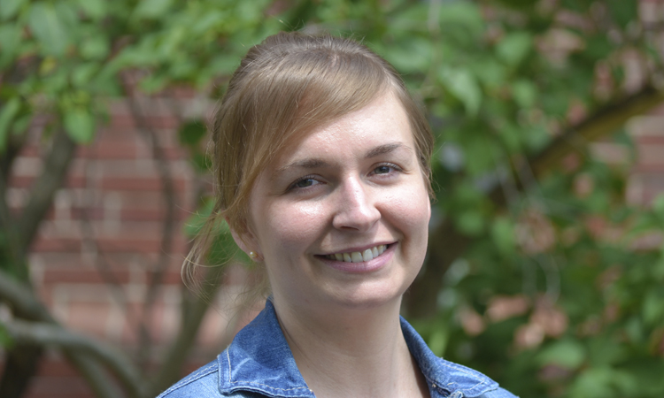

# People

  

    
  

  

    <h2>About the Reich Lab</h2>
    

      Led by PI Nicholas Reich and based in the
      <a href="http://www.umass.edu/sphhs/biostatistics" target="_blank">Department
      of Biostatistics and Epidemiology at the University of Massachusetts
      Amherst</a>, the Reich Lab focuses on developing statistical methods and
      tools for data arising from infectious disease settings.
    

    

      We use statistics, data science, and epidemiology to gain better
      understanding of the complexities of infectious disease dynamics. Our work
      has been featured in the
      <a href="http://www.nytimes.com/2013/07/09/health/understanding-the-protective-side-of-dengue-virus.html" target="_blank">
        New York Times</a> and on
      <a href="http://nepr.net/news/2014/11/24/flu-season-made-easy-with-new-tool/" target="_blank">
        New England Public Radio</a>.
    

    

      With active funded projects from the NIH, DARPA, CDC, and VA, the Lab is
      involved in independent and collaborative research efforts. Our
      collaborators include the Infectious Disease Dynamics Working Group at
      Johns Hopkins, the Thai Ministry of Public Health, the Dengue Branch of
      the CDC in Puerto Rico, the New York City Department of Health and Mental
      Hygiene, the Children's Hospital Colorado, and the Veterans Health
      Administration branches in New York City and Iowa City.
    

  

  

    

      

        
      

      

        <h4 class="card-title">Nicholas Reich</h4>
        <h6 class="card-subtitle">Principal Investigator</h6>
      

      

        Nick's research focuses on developing statistical methods for analyzing
        infectious disease data. He also enjoys hiking, canoeing, and juggling.
      

      

        <a href="https://scholar.google.com/citations?hl=en&user=AQUsdvkAAAAJ" class="btn btn-primary">Google Scholar</a>
        <a href="https://twitter.com/reichlab" class="btn btn-primary">Twitter</a>
        <a href="https://people.umass.edu/nick/cvReich.pdf" class="btn btn-primary">CV</a>
      

    

  

  

    

      

        
      

      

        <h4 class="card-title">Alexandria (Lexi) Brown</h4>
        <h6 class="card-subtitle">Post-doctoral fellow</h6>
      

      

        Lexi received her PhD in Organismic and Evolutionary Biology. She is
        interested in machine learning and developing intelligent, interpretable
        statistical models for analyzing infectious diseases in human
        populations.
      

      

        <a href="https://drive.google.com/file/d/0B-fpi_ROKnbcQ3ZrbVh3UVY1SE0/view?usp=sharing" class="btn btn-primary">CV</a>
      

    

  

  

    

      

        
      

      

        <h4 class="card-title">Evan Ray</h4>
        <h6 class="card-subtitle">Post-doctoral fellow</h6>
      

      

        Evan got his PhD in statistics developing methods to infer physical
        activity type and intensity from accelerometer data. He is working on
        developing inference techniques for multi-pathogen disease models.
      

      

        <a href="assets/misc/Evan_Ray_CV.pdf" class="btn btn-primary">CV</a>
      

    

  

  

    

      

        
      

      

        <h4 class="card-title">Krzysztof Sakrejda</h4>
        <h6 class="card-subtitle">Post-doctoral fellow</h6>
      

      

        Krzysztof received his PhD in Organismic and Evolutionary Biology
        studying environmental sensitivty in survival and developing
        time-to-event and local regression models for mark-recapture data. He is
        working on incorporating time-delayed data into predictive disease
        models.
      

      

        <a href="https://scholar.google.com/citations?user=nWWt_dMAAAAJ&hl=en" class="btn btn-primary">Google Scholar</a>
        <a href="https://github.com/sakrejda" class="btn btn-primary">Github</a>
      

    

  

  

    

      

        
      

      

        <h4 class="card-title">Stephen Lauer</h4>
        <h6 class="card-subtitle">PhD student</h6>
      

      

        Stephen is a graduate researcher pursuing his PhD in biostatistics. His
        work focuses on developing tools to make and evaluate real-time
        infectious disease forecasts, such as the
        <a href="http://iddynamics.jhsph.edu/apps/shiny/ALERT/">Shiny web
          application</a> for the ALERT algorithm. He likes the NBA and maps.
      

      

        <a href="https://scholar.google.com/citations?user=EEKbG5sAAAAJ&hl=en" class="btn btn-primary">Google Scholar</a>
        <a href="https://twitter.com/salauer_biostat" class="btn btn-primary">Twitter</a>
      

    

  

  

    

      

        
      

      

        <h4 class="card-title">Xi Meng</h4>
        <h6 class="card-subtitle">MS student</h6>
      

      

        Xi received her BS degree from Beijing Institute of Technology with a
        major in Electrical Engineering. She is working as a research assistant
        to conduct simulation studies and analysis on multi-strain infectious
        disease time-series data.
      

      

        <a href="https://drive.google.com/file/d/0B66FkAegj6nrdlZPSXlIZm9jWDQ/view" class="btn btn-primary">CV</a>
      

    

  

  

    

      

        
      

      

        <h4 class="card-title">Harley Jean</h4>
        <h6 class="card-subtitle">Undergraduate</h6>
      

      

        Harley is a senior Public Health major at UMass-Amherst. He is working
        as a research assistant, investigating methods for analyzing spatial
        dynamics of infectious disease time-series data.
      

      

        <a href="https://drive.google.com/file/d/0B66FkAegj6nrdlZPSXlIZm9jWDQ/view" class="btn btn-primary">CV</a>
      

    

  

  

    

      

        
      

      

        <h4 class="card-title">Abhinav Tushar</h4>
        <h6 class="card-subtitle">MS Student</h6>
      

      

        Abhinav is an MS student in Computer Science department. He is
        interested in machine learning and data science.
      

      

        <a href="https://github.com/lepisma" class="btn btn-primary">Github</a>
        <a href="https://lepisma.github.io/about" class="btn btn-primary">Home Page</a>
      

    

  

  

    

      

        
      

      

        <h4 class="card-title">Matthew Cornell</h4>
        <h6 class="card-subtitle">Software Engineer</h6>
      

      

        Matt is the lab's research software engineer. His M.S. is in Computer
        Science from UMass/Amherst, and his B.S. is in E.E. Before grad school
        he worked for NASA's Kennedy Space Center in Space Shuttle operations.
        Since then he's worked for decades in various AI research labs, writing
        all types of software.
      

      

        <a href="http://www.matthewcornell.org" class="btn btn-primary">My Site</a>
        <a href="https://www.linkedin.com/in/matthewcornell" class="btn btn-primary">LinkedIn</a>
      

    

  

